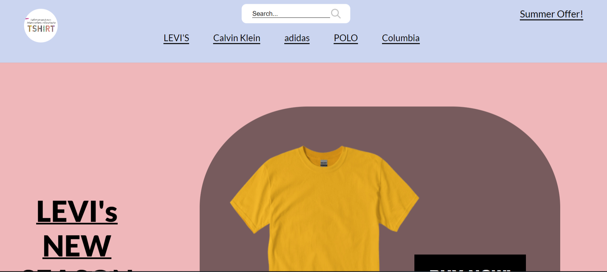
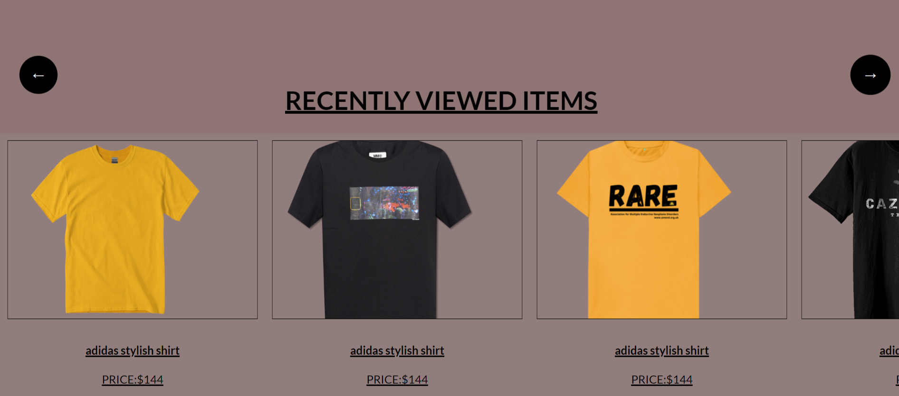

# T-Shirt Store Projects

## T-Shirt Store

### Overview
The T-Shirt Store is a dynamic web application showcasing a variety of t-shirts from different brands. The website features a slider for highlighting special offers, a product catalog, and interactive elements for user engagement. The page layout is designed to be responsive and user-friendly.

### Features
- **Navigation Bar**: Includes a search bar, limited offers, and brand menu items.
- **Slider**: Showcases new collections and special offers with navigation buttons.
- **Product Cards**: Displays recently viewed items with images, titles, prices, and buy buttons.
- **Features Section**: Highlights key features such as free shipping, returns, gift cards, and contact information.
- **Newsletter Subscription**: Allows users to subscribe to the newsletter.
- **Footer**: Contains links to company information, useful links, and social media icons.
- **Modal Forms**: Login and signup forms with validation messages.

### Screenshots

### Setup

1. **Open the HTML File**:
    - Open `index.html` in a web browser to view the T-Shirt Store page.

2. **Include CSS and JavaScript**:
    - Ensure that the CSS file `shirt.css` and the JavaScript file `shirt.js` are correctly linked and located in the project directory.

### CSS
The `shirt.css` file contains the styles for various components including navigation, slider, product cards, and footer. Ensure to adjust the styles as needed to fit the desired design.

### JavaScript
The `shirt.js` file manages interactive features such as:
- Slider functionality.
- Product card navigation.
- Smooth scrolling to sections.
- Form handling.

---

